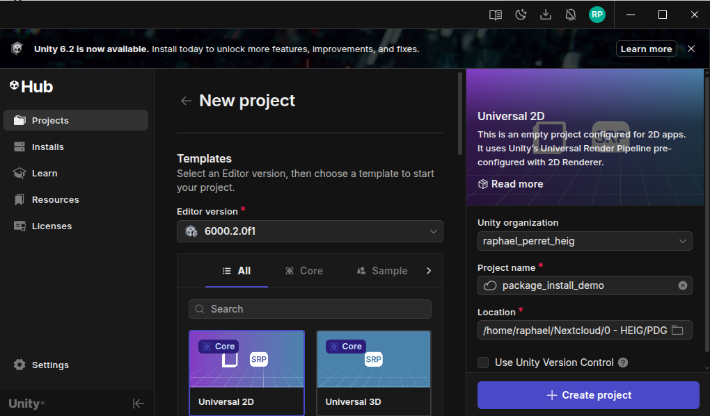
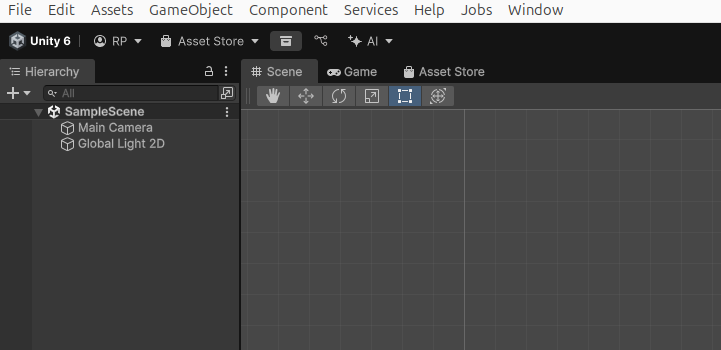
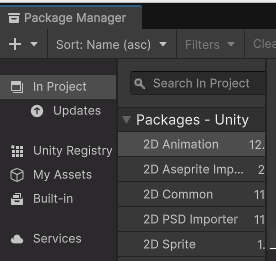
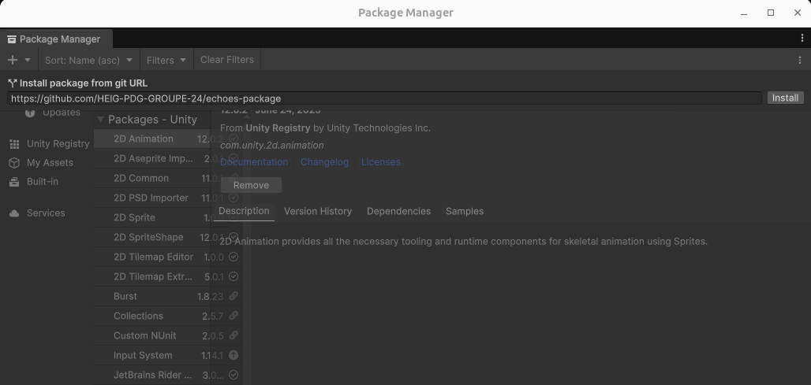
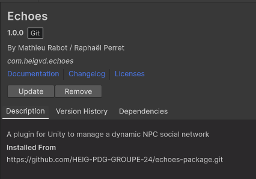

 

  <h3 align="center">Echoes</h3>

  

    A plugin for Unity to manage a dynamic NPC social network!
     
     
    <a href="">View Demo</a>
    &middot;
    <a href="https://heig-pdg-groupe-24.github.io/landing-page/">Landing page</a>
    &middot;
    <a href="https://heig-pdg-groupe-24.github.io/documentation/index.html">Documentation Site</a>

<!-- ABOUT THE PROJECT -->
## About The Project

### Problem Statement

In most games, NPCs feel flat. They don’t really talk about you, don’t share what they know, and only react in scripted ways. If you want NPCs that act like a small society with trust, rumors, opinions, and factions you usually have to build the whole system from scratch. That takes a lot of time for something many devs would like “out of the box.”

Our library solves this by giving you a ready system where NPCs can:

* Have a relationship between NPCs (contacts, trust, factions).
* Have dynamic opinions (friendship, distrust, hostility, admiration, etc.).
* Have a rumor system allowing NPCs to propagate information to contacts.
* Dialogue or behavior conditions based on these opinions.

The goal is to provide developers with a reusable, modular, and easy-to-integrate tool to enrich their narrative games, RPGs, or social simulations.

### Functional Requirements

* Create/Edit NPCs via a custom Unity UI.
* Manage contacts (relationship type, trust level, distance).
* Dynamically update an NPC's opinion of the player or another NPC.
* Simulate rumor propagation with delays and reliability based on trust links.
* Expose a simple API (e.g., `npc.GetOpinionOf(player)`, `npc.SpreadRumor(...)`).
* Support factions (alignments that influence initial opinion).
* Support favorites subjects (e.g., favorite food, hobbies) to influence opinions.

### Non-Functional Requirements

* *Performance*: The plugin should support hundreds of NPCs without significantly impacting the framerate.
* *Extensibility*: It should be easy to extend (e.g., adding a new type of emotion/opinion).
* *Compatibility*: Compatible with Unity 6.2 and later.
* *Documentation*: Clear documentation with usage examples.
* *Testability*: The architecture should be decoupled (using patterns like Observer, Strategy, ScriptableObjects).

### Technical choices

We decided to use Unity as the development platform for this plugin, given its popularity and flexibility for game development. Especially because as us developers, we aren't familiar with it and it is a good opportunity to learn.

We will use the following technologies and patterns to implement the plugin:

* *Unity version*: 6.2 or later.
* *Programming Language*: C# (standard Unity).
* *Architecture*:
    * ScriptableObjects to define NPCs, factions, and rumor tables.
    * Graph/Network model to represent contacts.
    * Event System (Observer pattern) to notify opinion changes.
    * Custom Unity Editor to represent NPCs, relationships, and opinions (With Odin Inspector or similar).
    * Data Persistence via JSON or serialized ScriptableObjects.
    * Unit tests with NUnit.

### Built With

Software and library used :

* [![Unity][Unity]][Unity-url]
* [NodeGraphProccessor](https://github.com/alelievr/NodeGraphProcessor)
* [Odin Inspector](https://odininspector.com/)

<!-- GETTING STARTED -->
## Getting Started

### Prerequisites

### Installation
This guide provides the most straightforward way to setup Echoes in your project. We utilise unity package manager to import the latest version straight from our repository.

#### Unity
Follow [Unity's official documentation](https://docs.unity3d.com/hub/manual/InstallHub.html) to install Unity on your system.
You will need a valid Unity license, a free personal license is sufficient. Login to Unity Hub and create a new project.

#### Import Package
Open the unity package manager  
  

Click add, add package from git repository  
  

On the package github repository, copy the code import https url and paste it in the git url field in the unity package manager, then click install.  
  

You should then get this overview of the package. To upgrade to the latest version, simply click update.  
  

<!-- USAGE EXAMPLES -->
## Usage

For a more specific example, you can refer to the video demo available on the [landing page](https://heig-pdg-groupe-24.github.io/landing-page/).

<!-- CONTACT -->
## Contact

Mathieu Rabot / Nomeos - [Github](https://github.com/Nomeos)

Raphaël Perret / rp2709 - [Github](https://github.com/rp2709)

<!-- MARKDOWN LINKS & IMAGES -->
<!-- https://www.markdownguide.org/basic-syntax/#reference-style-links -->
[Unity]: https://img.shields.io/badge/Unity-000000?style=for-the-badge&logo=unity&logoColor=white
[Unity-url]: https://unity.com/
